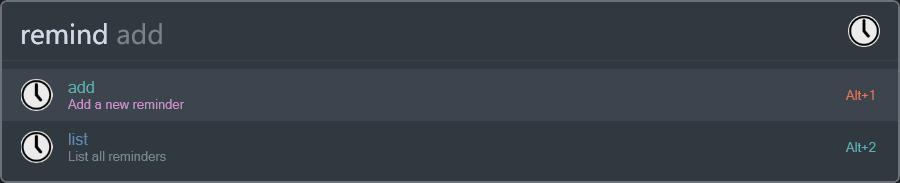
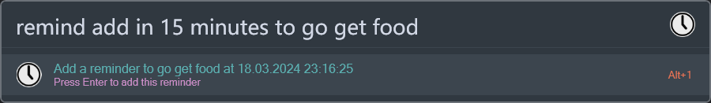

# Remind me

This is a [Flow Launcher](https://github.com/Flow-Launcher/Flow.Launcher) plugin to remind you of something at a
specific time. Please note that it will not work if you close Flow Launcher. Also, the feature for persisting
reminders between Flow Launcher restarts hasn't been thoroughly tested. Don't use this for anything important.

## Usage

- `remind add in 5 minutes to stretch`
- `remind 5m stretch` (enable short form in settings)
- `remind 11:30am standup` (short form)
- `remind 04:00 p.m. check reports` (short form)
- `remind 4 pm stretch` (short form)
- `remind 22:30 go to bed` (short form)

